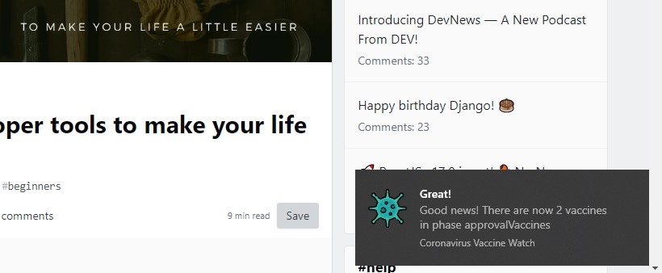

<h1 align="center">
    💉 Coronavirus Vaccine Watch 🌎
</h1>

<p align="center">
    📰 <b>Stay informed about the development of the coronavirus vaccine</b> through its phases. 💉
</p>
<p align="center">
    🎆 <b>Receive a beautiful notification</b> every time there is progress. 🎉
</p>

<p align="center">
<a href="https://reactjs.org/"></a>
<a href="http://electronjs.org/"></a>
<a href="https://www.npmjs.com/package/node-notifier"></a>
</p>


<br />


## 🚀 Deployment
📦 Install all the dependencies
```bash
npm install
```
💉 Run and inject the app
```bash
npm start
```

# ✍ Authors
- **@360macky** - I just got vaccinated.
